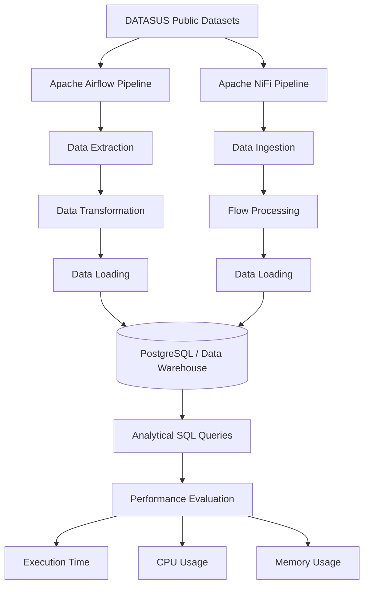

# etl-airflow-nifi-benchmark
Performance benchmark of Apache Airflow and Apache NiFi for ETL pipelines using DATASUS healthcare data.

# ETL Benchmark: Apache Airflow vs Apache NiFi

Comparative benchmark of Apache Airflow and Apache NiFi for large-scale ETL pipelines using public Brazilian healthcare datasets from DATASUS.

## Architecture

Dataset

The project used public Brazilian healthcare datasets, including:

SIA/DATASUS
CNES
SIGTAP
CID
CBO
Brazilian municipalities data

More than 40 million records were processed during the experiments.

etl-airflow-nifi-benchmark/
│
├── airflow/
│   └── dags/
│
├── nifi/
│   └── templates/
│
├── sql/
│
├── scripts/
│
├── diagrams/
│
├── images/
│
├── docs/
│
└── sample_data/

Important Note

The original experiments were executed using institutional infrastructure from CEFET-MG and CIT/UFMG, including Hadoop cluster resources.

For this reason, the complete execution environment cannot be fully reproduced using only this repository.

This repository focuses on documenting the architecture, source code, methodology and results obtained during the research.

Author

Lucas Loscheider Reis Muniz
Computer Engineering — CEFET-MG

LinkedIn: https://www.linkedin.com/in/lucas-loscheider

Depois clique em **Commit changes**.

Próximo passo: vamos criar a seção de **resultados**, com tabela comparando Airflow e NiFi.
