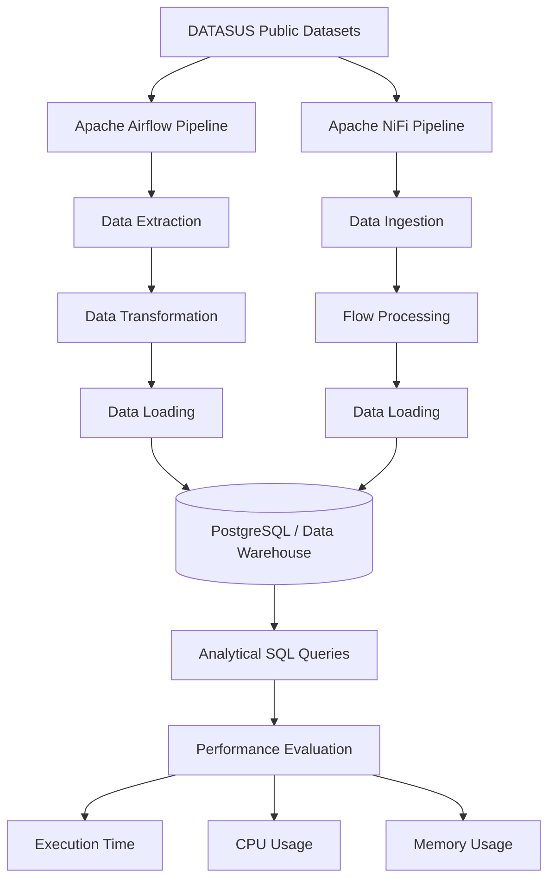

# etl-airflow-nifi-benchmark
Performance benchmark of Apache Airflow and Apache NiFi for ETL pipelines using DATASUS healthcare data.

# ETL Benchmark: Apache Airflow vs Apache NiFi

Comparative benchmark of Apache Airflow and Apache NiFi for large-scale ETL pipelines using public Brazilian healthcare datasets from DATASUS.

## Architecture

