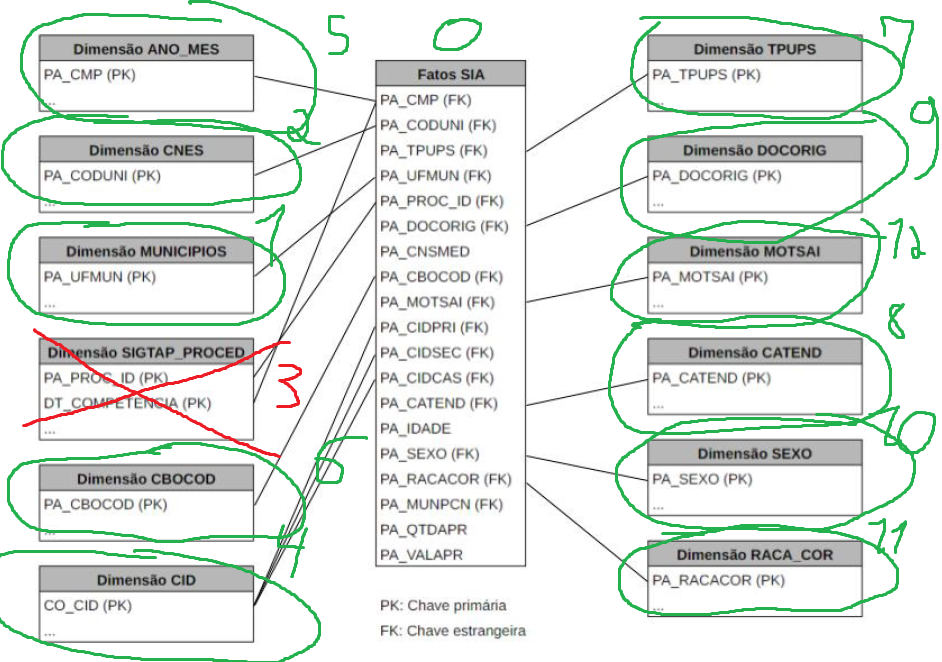

# ETL Benchmark: Apache Airflow vs Apache NiFi


> Comparative benchmark of Apache Airflow and Apache NiFi for large-scale ETL pipelines using Brazilian public healthcare datasets (DATASUS).

---

## Overview

This repository contains the implementation, documentation and benchmark results of my undergraduate thesis developed for the Computer Engineering degree at **CEFET-MG**.

The project compares **Apache Airflow** and **Apache NiFi** through equivalent ETL pipelines built to process real-world healthcare datasets from DATASUS.

The benchmark evaluates:

- Execution time
- CPU utilization
- Memory consumption
- Workflow maintainability
- ETL orchestration

---

## Technologies

| Category | Technologies |
|-----------|-------------|
| Programming | Python, SQL |
| ETL | Apache Airflow, Apache NiFi |
| Big Data | Apache Spark, Hadoop Hive |
| Database | PostgreSQL |
| Infrastructure | Docker, Linux |
| Version Control | Git, Bitbucket |

---

## Dataset

The benchmark used Brazilian public healthcare datasets.

- DATASUS (SIA)
- CNES
- SIGTAP
- CID
- Brazilian Municipalities

**More than 42 million records** were processed during the experiments.

---

# Project Structure

```
etl-airflow-nifi-benchmark
│
├── airflow/
│
├── nifi/
│
├── sql/
│
├── diagrams/
│
├── images/
│
├── docs/
│
├── README.md
├── LICENSE
└── .gitignore
```

---

# ETL Architecture

> Overall ETL architecture used during the benchmark.


---

# Database Model

The following diagram illustrates the database structure adopted during the project.



---

# Apache Airflow Pipeline

The following DAG orchestrates the ETL workflow implemented using Apache Airflow.


---

# Apache NiFi Pipeline

The following process group implements the same ETL workflow using Apache NiFi.


---

# Performance Evaluation

The benchmark was executed multiple times under the same environment.

## Average Execution Time

| Tool | Average Time |
|------|-------------:|
| Apache Airflow | 01:41:14 |
| Apache NiFi | 00:39:00 |

---

## CPU Usage


---

## RAM Usage


---

## RAM Percentage


---

## System Load


---

# Benchmark Summary

| Metric | Apache Airflow | Apache NiFi |
|---------|---------------:|------------:|
| Average execution time | 01:41:14 | 00:39:00 |
| CPU usage | ~3–4% | ~4–5% |
| RAM usage | ~2.0–2.6 GB | ~2.0–2.7 GB |

---

# Repository Contents

This repository includes:

- Apache Airflow DAGs
- Apache NiFi templates
- SQL scripts
- Benchmark charts
- Database documentation
- ETL architecture
- Undergraduate thesis

---

# Reproducibility

The experiments were executed using the infrastructure provided by **CEFET-MG** and the **Centro de Inteligência Territorial (CIT/UFMG)**.

The original environment included Hadoop cluster resources that are not publicly available.

For this reason, this repository focuses on documenting the implementation, architecture and benchmark results rather than providing a fully reproducible environment.

---

# References

- Apache Airflow
- Apache NiFi
- Apache Spark
- PostgreSQL
- DATASUS

---

# Author

**Lucas Loscheider Reis Muniz**

Computer Engineering — CEFET-MG

- LinkedIn: https://www.linkedin.com/in/lucas-loscheider
- GitHub: https://github.com/lucaslc01
